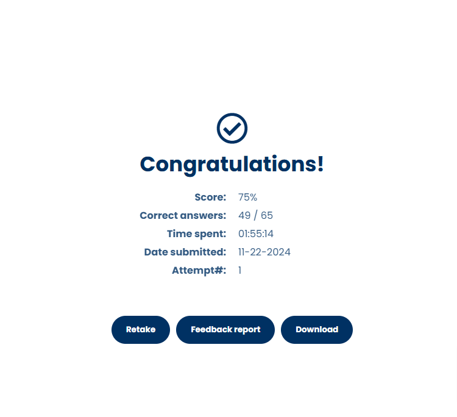

## Getting Started

First, run the development server:

```bash
npm run dev
# or
yarn dev
# or
pnpm dev
# or
bun dev
```

Open [http://localhost:3000](http://localhost:3000) with your browser to see the result.

## Getting Questions

After you take the exams on Digital Cloud Training you see this screen:


Click the Feedback Report Button to open the popup.

Open the developer chrome tools and paste following script in the console and hit enter:
```js
async function scrollAndWaitForContent(selector) {
    const elements = document.querySelectorAll(selector);
    const wrong = [];

    for (const element of elements) {
        // Scroll element into view
        element.scrollIntoView({ behavior: "smooth", block: "center" });

        // Wait for any dynamic content to load
        await new Promise((resolve) => setTimeout(resolve, 1000));

        const isIncorrect = element.querySelectorAll("div.feedback-wrong-answer").length > 0;

        if (isIncorrect) {
            var choices;
            var answer;
            var isMultiple = element.querySelectorAll(".multiple-options-correctness-column").length > 0; 

            if (isMultiple) {
                choices = Array.from(element.querySelectorAll(".lw-qn-mc-options .right-col")[0].children).map((el) => el.textContent.trim());
                answer = Array.from(element.querySelectorAll(".correct-answers-wrapper .lw-ass-widget-wrapper")).map((el) => el.textContent.trim());
            } else {
                choices = Array.from(element.querySelectorAll('.lw-qn-mc-options')[0].children).map(el => el.textContent.trim());
                answer = element.querySelectorAll(".correct-answers-wrapper .lw-ass-widget-wrapper")[0].textContent.trim();
            }

            var data = {
                question: element.querySelectorAll(".lw-ass-widget-wrapper")[0].textContent.trim(),
                choices,
                answer,
                reason: element.querySelectorAll(".author-feedback-wrapper .learnworlds-main-text-small")[0].textContent.trim(),
            };
            wrong.push(data);
        }
    }

    console.log(wrong);
}

```
A function is now in the console that allows you to run:
> [!WARNING]
> Make sure the popup is scrolled to the top and make sure that you have opened the element element in the elements explorer
```
scrollAndWaitForContent('div.mb-50')
```
The ```div.mb-50``` is where the answers are held in the html.

When data is consoled out you can write click and save as a global variable to ```JSON.stringify``` and use the ```copy(whatever_variable_name_you_used)``` console command to grab the data.

You can see an example in the ```app/components/questions.json``` file.

The app handles multiple questions and single questions. It will also grade you.
